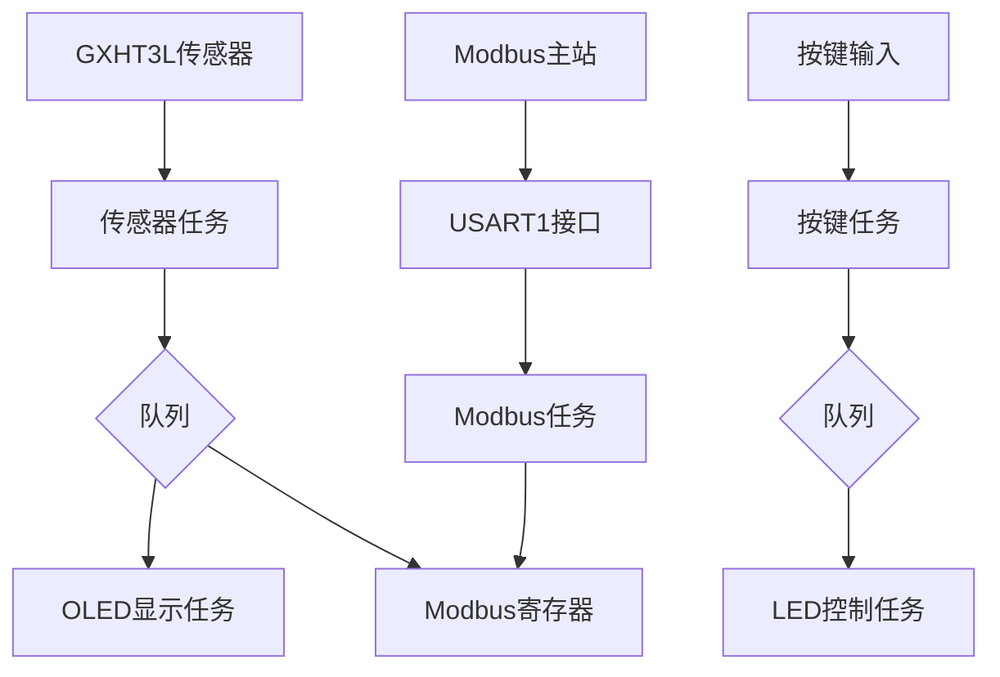

# STM32 FreeRTOS 多任务系统技术文档

## 项目概述

本项目基于STM32微控制器，使用FreeRTOS实时操作系统构建了一个多任务嵌入式系统。
系统集成了温湿度传感器、OLED显示屏、LED控制、按键输入和Modbus通信功能，实现了数据采集、显示、控制和通信的一体化解决方案。

## 系统架构

### 主要组件
- **主控制器**: STM32F103RCTx - LQFP64
- **实时操作系统**: FreeRTOS
- **传感器**: GXHT3L温湿度传感器 (I2C接口)
- **显示**: OLED显示屏 (SPI接口)
- **通信**: Modbus RTU协议 (UART接口)
- **输入**: 按键控制
- **输出**: LED指示灯

### 系统初始化流程
1. 硬件初始化 (`HAL_Init()`, `SystemClock_Config()`)
2. 外设初始化 (`MX_GPIO_Init()`, `MX_DMA_Init()`, `MX_USART1_UART_Init()`等)
3. FreeRTOS内核初始化 (`osKernelInitialize()`)
4. 各模块任务初始化 (`MX_FREERTOS_Init()`)
5. 启动任务调度器 (`vTaskStartScheduler()`)

## 任务模块详解

### 1. 温湿度传感器任务 (GXHT3L)

**功能**: 定期读取GXHT3L传感器的温湿度数据，并将数据发送给OLED显示和Modbus通信模块。

**关键函数**:
- `i2c_GXHT3L_task_init()`: 初始化传感器任务
- `GXHT3L_Read_Task()`: 传感器数据读取主循环

**特点**:
- 每2秒读取一次数据
- 使用CRC校验确保数据完整性
- 通过队列将数据传递给其他任务

### 2. OLED显示任务

**功能**: 在OLED屏幕上显示温湿度数据。

**关键函数**:
- `Spi_Oled_Task_Init()`: 初始化OLED显示任务
- `SPI_OLED_TASK()`: OLED显示主循环

**特点**:
- 实时更新温湿度显示
- 使用队列接收传感器数据

### 3. LED控制任务

**功能**: 控制LED灯的各种模式。

**关键函数**:
- `Led_task_init()`: 初始化LED控制任务
- `StartLedTask()`: LED控制主循环
- `Read_LedState_Task()`: LED状态处理

**特点**:
- 支持多种LED模式（单个点亮、双闪、三闪等）
- 通过队列接收控制指令

### 4. 按键处理任务

**功能**: 处理按键输入，控制LED模式和参数。

**关键函数**:
- `key_task_init()`: 初始化按键处理任务
- `Key_Scan_Task()`: 按键扫描主循环
- `key_press_handler()`: 按键状态机处理

**特点**:
- 支持短按、长按、双击等复杂按键操作
- 状态机处理按键逻辑
- 通过队列向LED任务发送控制指令

### 5. Modbus通信任务

**功能**: 实现Modbus RTU协议通信，支持读写寄存器。

**关键函数**:
- `Modbus_Task_init()`: 初始化Modbus任务
- `Modbus_Control_Task()`: Modbus通信主循环
- `Modbus_Process()`: Modbus协议处理

**特点**:
- 支持0x03（读保持寄存器）和0x06（写单个寄存器）功能码
- 使用DMA和空闲中断提高通信效率
- 通过互斥量保护共享寄存器数据

## 数据流

## 通信协议

### Modbus寄存器映射

| 地址 | 名称 | 描述 | 数据格式 |
|------|------|------|----------|
| 0x0000 | 温度 | 当前温度值 | 253表示25.3°C |
| 0x0001 | 湿度 | 当前湿度值 | 605表示60.5% |
| 0x0002 | LED状态 | LED控制寄存器 | 0=关闭, 1=开启 |
| 0x0003 | 状态字 | 系统状态寄存器 | 保留 |

## 系统特性

### 实时性
- 使用FreeRTOS任务调度实现多任务并发执行
- 优先级分配确保关键任务及时响应

### 可靠性
- 数据传输采用CRC校验
- 使用互斥量保护共享资源
- 异常处理机制

### 可扩展性
- 模块化设计便于功能扩展
- 队列通信机制支持任务间解耦

## 使用说明

### 硬件连接
- GXHT3L传感器连接到I2C2接口
- OLED显示屏连接到SPI3接口
- Modbus通信通过USART1实现
- 按键连接到GPIO引脚
- LED连接到GPIO引脚

### 软件配置
- 使用STM32CubeMX进行外设初始化配置
- 可调整任务优先级和堆栈大小优化系统性能

## 故障排查

### 常见问题和调试
1.任务创建失败

现象: 新建的任务，没有运行，通过debug抓取了xReturned的返回值发现等于-1。
原因: FreeRTOS 默认堆空间不足。
解决: 在 CubeMX 中调整TOTAL_HEAP_SIZE的大小，重新编译后任务创建成功。

2.串口数据接收不完整

现象: 使用USART1的DMA接收到的数据不完整，在debug下看到每次的数据都是只有开头几个数据。
原因: 外设初始化顺序不当，DMA 未在串口使能前正确配置。
解决: 在 CubeMX 中调整外设初始化顺序，将 MX_DMA_Init() 放在 MX_USART1_UART_Init() 之前，
保证 DMA 通道在串口启动前就绪，此后能够完整接收数据。

3.OLED 显示异常

现象: 烧录后 OLED 偶尔不显示，需要多次复位才能正常工作。
原因: OLED 驱动芯片上电复位时序不稳定，初始化时未能正确完成复位。
解决: 在 OLED_Init() 前增加上电延时，并确保复位引脚正确控制，高低电平时序满足要求，问题得到缓解。
